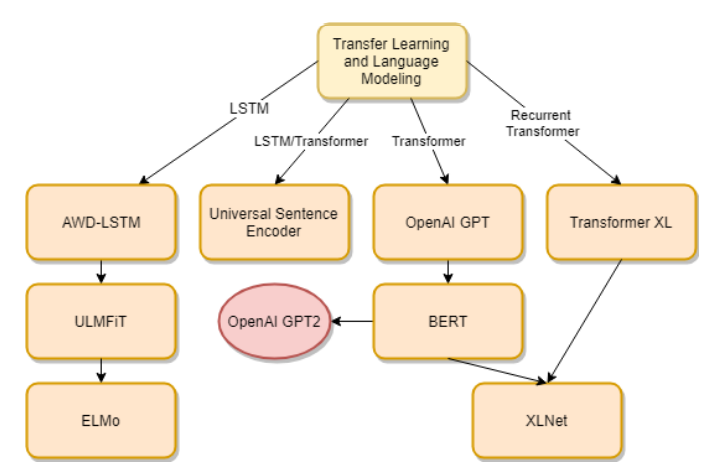

# UnderstandingTransferLearning4NLP
A repository to hold my learning materials and codes related to Transfer Learning for NLP

## Learning Notes
### Overview of BERT (PART 1)
[https://senthilkumarm1901.github.io/UnderstandingTransferLearning4NLP/docs/BERT_overview.html](https://senthilkumarm1901.github.io/UnderstandingTransferLearning4NLP/docs/BERT_overview.html)

### BERT Indepth View (PART 2)
[https://senthilkumarm1901.github.io/UnderstandingTransferLearning4NLP/docs/BERT_indepth_view.html](https://senthilkumarm1901.github.io/UnderstandingTransferLearning4NLP/docs/BERT_indepth_view.html)

### Evolution of TL in NLP
[https://senthilkumarm1901.github.io/UnderstandingTransferLearning4NLP/docs/Evolution_of_TL_in_NLP.html](https://senthilkumarm1901.github.io/UnderstandingTransferLearning4NLP/docs/Evolution_of_TL_in_NLP.html)

